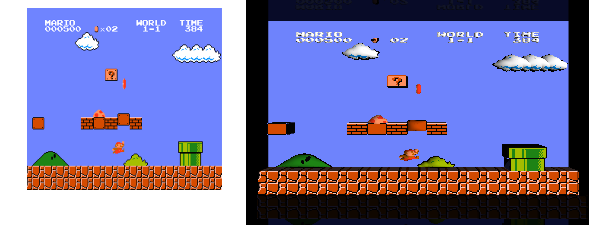

# Project Overview
This is a 3D renderer for NES that transforms the sprites into higher resolution
images and corresponding 3D models and renders them in 3D.

I had the idea to work on this project for a while, and decided to dedicate
a few of the days over the 2019 christmas break to working on the project.

The image below gives an example of what the rendering looks like for super mario brothers 1:

# Screenshots

# Details
The following sections contain some of the interesting tidbits about the interesting
parts of the project.

* [Game state representation](#game-state-representation)
* [Grouping sprites](#grouping-sprites)
* [Image upsampling](#image-upsampling)
* [Creating 3D models](#creating-3d-models)

## Game State Representation
My old emulator was something that I had written in 2006, so I didn't exactly have good engineering
practices, nor did I completely know what I was doing. Rather than incorporate the
renderer directly into that hacked mess,  the game state is exported into the
[render_state.proto](src/render_state.proto).

The proto consists of a sequence of FrameState entries that contain relevant information
about the image and sprite pallettes, name tables, and other relevant information from
the PPU. It should be fairly straightforward to similar PPU state information from any
other emulator.

## Grouping sprites
The NESs 8x8 sprites are grouped into larger objects based on whether the sprites 
appear adjacent to each other (on 8x8 grid) and whether the colors between the neighboring blocks
are in rough agreement (e.g., how many colors are the same). There are a few more heuristics here,
such as looking at continuity along the edge.

### Walkable surfaces
In a rather 2D scroller specific way, sprites in the background are grouped similarly
as above. But they are also classified into walkable and non-walkable surfaces based
on the presence of vertical image gradient at the top border. Groups of blocks that are categorized as "walkable" 
are assumed to be cubes and are rendered as such.

## Image Upsampling

Initially I was hoping to try to super-res the textures and hope to add some
missing detail (e.g., to get them to be photorealistic). I didn't really look into the
literature to see what could be done here, but obviously simple nearest neighbor or
bilinear filtering wouldn't work.

I initially thought to try and produce an upsampled silhouette so that when it was
downsampled (with nearest neighbor) that it would exactly produce the low-res
silhouette. I'd formulated this as a linear problem with constraints on the gradient
of the image, solved only on the boundary between the black and white regions.
Thresholding the solution of the system of equations would give the upsampled 
highres image (and this could be done for each color in the palletized image).

In the end, simply linearly upsampling and gaussian filtering each color binary
palettized image produced similar results. Although, the final thresholded "color"
channel isn't used directly. Instead, the floating point image is treated as a probability,
and the color is selected from the palettized image with the highest probability. 

## Creating 3D models
The 3D model for a sprite group is created by extracting the silhouette
from the upresed texture, and then blowing up a 3D model. A few different
approaches were attempted to produce the initial mesh:
* Delaunay triangulate the silhouette boundary with some evenly spaced interior points that are then extruded to produce the geometry
* Use a levelset 3D library to convert the silhouette into an initial 3D mesh.

The latter approach seemed to produce a less buggy result with points more regularly spaced.

The geometry is then evolved by moving along the normal with some interleaved stiffness constraints. This gives a nice puffed-up model, but it can deviate from the original silhouette significantly. Therefore, a subsequent Poisson-mesh edit is performed that ensure that the surface laplacian is close to the puffed up mesh, while keeping the points near the silhouette in place.

The resulting 3D models look a bit less like marshmallows. The top row in the following figures
shows the results without the geometric constraint on the silhouette and the bottom row is 
with the constraint:

